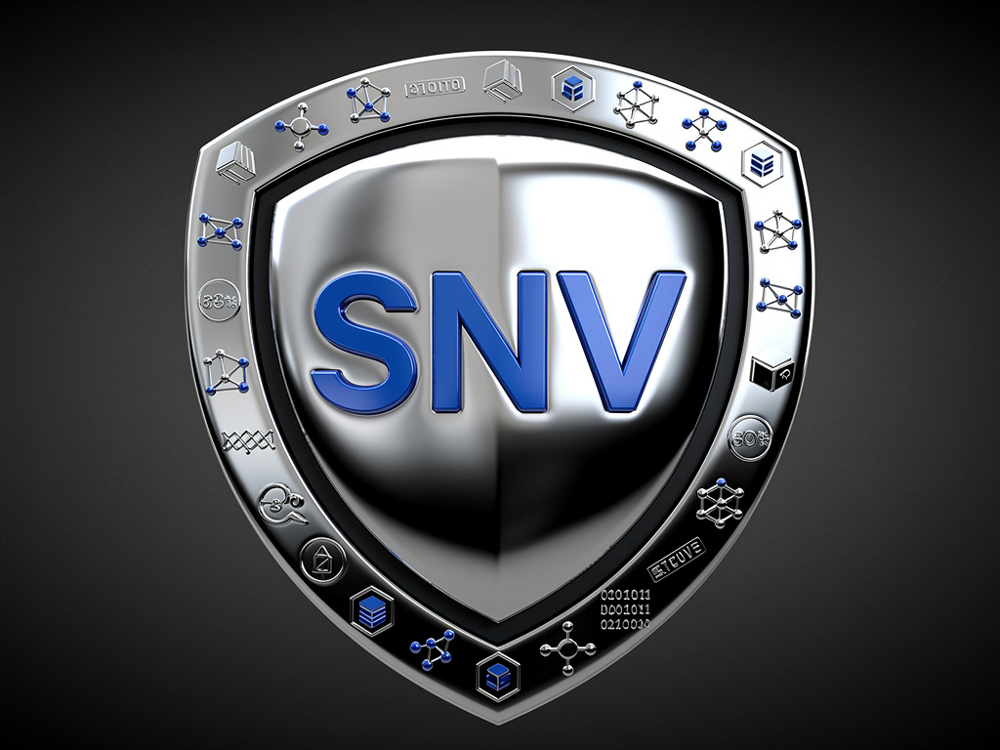
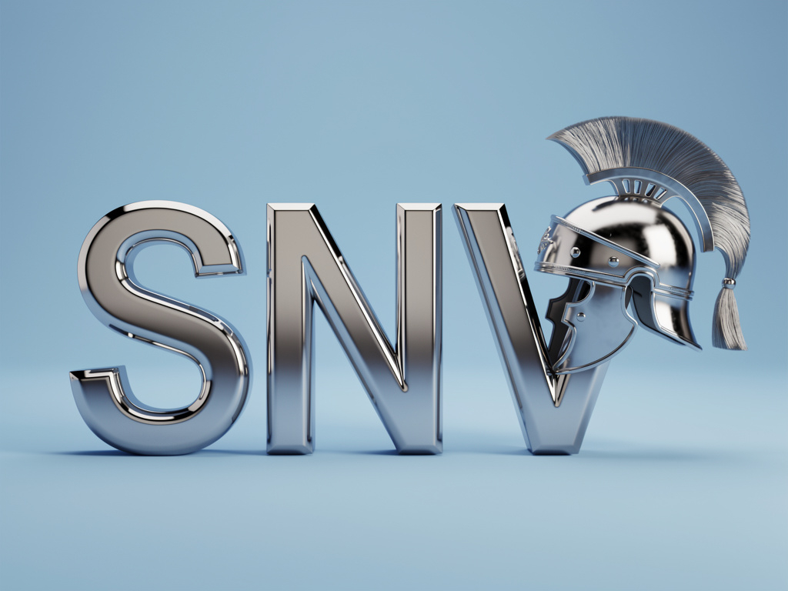

# SentryNodeValidation

# 🛡️ **SENTRY NODE VALIDATION (SNV)**  
### **Uptime Without Compromise**

---

 

# <u>🚀 About Sentry Node Validation</u>

**Sentry Node Validation (SNV)** is an independent, security-focused, multi-chain validator and infrastructure operator.  
We deliver:

- **Enterprise-grade uptime**  
- **Hardened infrastructure**  
- **Active governance participation**  
- **High-availability multi-region deployments**

Our goal is simple:  
> **Provide reliable, secure, professionally managed validator services across next-generation blockchain networks.**

---

# <u>🔧 Core Capabilities</u>

**Infrastructure & Operations**
- **Validator deployment** (testnet + mainnet)  
- **Secure Linux administration**  
- **Network hardening, firewalls, HA setups**  
- **Private RPC node hosting**  
- **Slash-protection & redundancy planning**

**Monitoring & Observability**
- Prometheus, Grafana, Loki  
- Alerting pipelines  
- Uptime/tracking automation  

**Chain Lifecycle Operations**
- Upgrade coordination  
- Chain-halt recovery  
- Peer optimization  
- Version migration, rollback procedures  

---

# <u>🛠️ Technical Experience</u>

- Linux systems engineering  
- High-availability node infrastructure  
- Automation (Bash + Python)  
- Blockchain node orchestration  
- Observability stacks  
- Chain migration & upgrade management  
- Data integrity verification  
- Multi-region deployment patterns  

---

# <u>🌐 Networks of Interest</u>

### **Cosmos Ecosystem**
- **Juno**  
- **Kujira**  
- **Osmosis**  
- **Kava**  
- **Sei**  
- **Neutron**

### **Emerging L1 / L2 Networks**
- **Initia**  
- **Saga**  
- **Namada**  
- **Movement Labs**

### **EVM Chains**
- **Avalanche**  
- **Berachain**  
- **Celo**

---

# <u>🧭 Infrastructure Philosophy</u>

- **High-uptime operation**  
- **Geographic redundancy**  
- **Automated monitoring & alerting**  
- **Security-first configuration**  
- **Minimal slash-risk posture**  
- **Transparency & professionalism**  
- **Active governance participation**  

---

# <u>📡 Current Focus</u>

SNV is actively contributing to top-tier testnets by supporting:

- Network stability and uptime  
- Testnet reliability and reporting  
- Consensus-layer improvements  
- Validator community participation  
- Multi-chain expansion and tooling development  

---

# <u>📬 Contact</u>

**Validator Name:** **Sentry Node Validation (SNV)**  
**Discord:** *your username*  
**GitHub:** https://github.com/yourprofile  
**Tagline:** **Uptime Without Compromise**

---

### 🛡️ **SNV — Professional, Reliable, Secure**  
**Thank you for supporting decentralized networks.**

